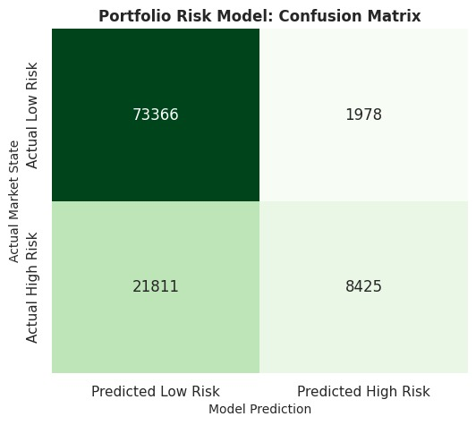
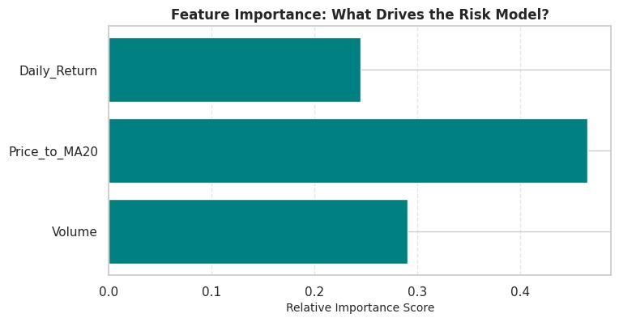
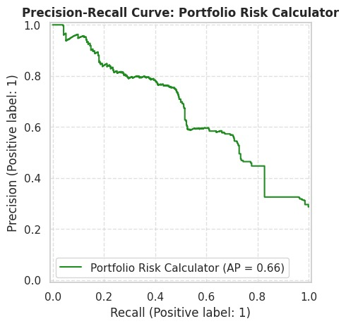

  

# Astock: Machine Learning & Portfolio Risk Intelligence Engine

An advanced financial machine learning pipeline engineered to predict market direction and assess portfolio risk states. This repository houses quantitative models designed to provide robust, leak-free risk classification and trend forecasting for modern trading workflows.

---

## Architecture & Core Models

The machine learning system is split into specialized dataframes and models to separate stock price direction forecasting from volatility-based risk assessment:

- **Stock Direction Model (`master_df`)** — Predicts short-term price movement directions (`Target`) across equities.
- **Portfolio Risk Classifier (`risk_df`)** — A specialized classification pipeline built to flag high-volatility, dangerous market states (`Risk_Target`) before adverse drawdowns impact positions.

---

## Feature Engineering & Data Leakage Prevention

To ensure institutional-grade integrity and prevent the model from "cheating" during training, rigorous feature selection protocols were applied to the risk model:

- **Target Definition** — `Risk_Target` is binary-encoded based on rolling volatility thresholds, flagging the top 20% highest volatility states.
- **Leakage Avoidance** — `Volatility_14d` was deliberately dropped from the active feature matrix because the target itself was derived from it.
- **Active Feature Set** — The risk model relies strictly on independent, non-leaking predictors:
  - `Daily_Return`
  - `Price_to_MA20` (price relative to the 20-day moving average)
  - `Volume`

---

## Training & Validation Strategy

To prevent look-ahead bias in time-series financial data, a strict chronological split is enforced rather than random shuffling:

| Step | Detail |
|---|---|
| **Train-Test Split** | Chronological 80/20 split (`split_idx_risk = int(len(risk_df) * 0.8)`) |
| **Training Data** | `risk_df[:split_idx_risk]` — historical market data used to fit pattern boundaries |
| **Testing Data** | `risk_df[split_idx_risk:]` — out-of-sample future timeline used for unbiased evaluation |
| **Algorithm** | `RandomForestClassifier(n_estimators=100, random_state=42, max_depth=5)` |

---

## Evaluation Metrics & Performance

Because financial datasets feature heavily imbalanced class distributions, reliance on raw accuracy is misleading. The model is evaluated across a comprehensive classification and probability error matrix:

| Metric | Score | Interpretation |
|---|---|---|
| **Precision** | 79.88% | Core strength — when the model flags high risk, it's correct nearly 80% of the time, minimizing false alarms |
| **Recall** | 18.89% | Conservative sniper — prioritizes high-confidence certainty over catching every volatile move |
| **F1 Score** | 30.55% | Harmonic balance between precision and recall for skewed financial distributions |
| **Accuracy** | 78.46% | Baseline measure, evaluated alongside precision to account for class imbalance |
| **MAE** | 0.2883 | Mean Absolute Error — tracks probability confidence calibration |
| **RMSE** | 0.3876 | Root Mean Squared Error — penalizes large probability deviation errors |

---

## Visualizations

### Confusion Matrix

  

This shows how the risk model's predictions line up against actual market states on the held-out test set. The model correctly identifies the large majority of low-risk periods (73,366 true negatives) and catches a meaningful share of high-risk periods (8,425 true positives), but it also misses a substantial number of genuinely high-risk states (21,811 false negatives). This pattern is consistent with the low recall reported in the metrics table above: the model would rather stay quiet than risk a false alarm, so it under-flags risk more often than it over-flags it.

### Feature Importance

  

This chart ranks how much each input feature contributes to the risk model's decisions. `Price_to_MA20` (price relative to its 20-day moving average) is the strongest driver, followed by `Volume`, with `Daily_Return` contributing the least. In other words, the model leans most heavily on how far a stock has drifted from its recent trend, rather than on the size of any single day's move.

### Precision-Recall Curve

  

This curve shows the trade-off between precision and recall as the model's decision threshold is varied, which is a more informative view than accuracy alone given the class imbalance between high- and low-risk states. Precision stays high (often above 0.7) through low-to-moderate recall before degrading, and the average precision (AP) of 0.66 summarizes that trade-off across all thresholds. It confirms that the model can be tuned toward either "catch more risk events" or "raise fewer false alarms," depending on the operating threshold chosen downstream.

---

## Tech Stack

- **Language:** Python
- **Data Processing:** Pandas, NumPy
- **Machine Learning:** Scikit-Learn (`RandomForestClassifier`)
- **Integration:** Next.js Dashboard Backend API / Frontend Interface

---

## Contributors

- Shubham Gupta
- Dipankar Roy
- Ansuman Shaw
- Firdos Khatoon

---

## Disclaimer

This project is for research and educational purposes only. Model outputs (direction predictions and risk flags) do not constitute financial advice. Past performance and backtested metrics do not guarantee future results — always apply independent risk management before acting on model signals.